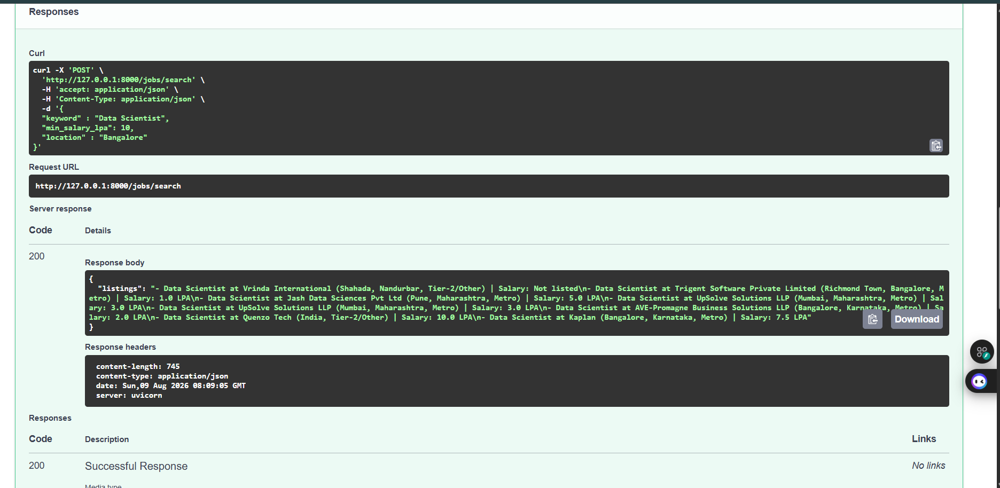

# JobGenie – AI Agent Workflow (Week 5)

Indian job market specialization built on top of the multi-agent LangGraph workflow from Week 4 (career assessment agent + job search agent, RAG-powered resume analysis, live Adzuna job search).

## Objective

Specialize the job search agent for the Indian job market — LPA salary formatting, city-based filtering, and metro vs. tier-2 classification — and expose the whole system through a FastAPI layer with multiple endpoints.

## Track Chosen

Indian Job Search Specialist (Track A, Option A1)

## Features Completed

- Job search now uses **LPA (Lakhs Per Annum)** salary format instead of raw numbers
- **Location-based filtering** by Indian city (e.g. Bangalore, Pune, Mumbai)
- Results tagged as **Metro vs Tier-2** city
- **FastAPI application** (`app/api.py`) with three endpoints:
  - `POST /assess-and-search` — runs the full career assessment + job search agent workflow
  - `POST /resume/query` — direct semantic search over the resume vector store
  - `POST /jobs/search` — direct call to the Adzuna job search tool with Indian-market parameters
- Interactive Swagger docs auto-generated at `/docs`, grouped by tag (Health, Workflow, Resume, Jobs)
- All endpoints wrapped in try/except, returning clean HTTP 500 errors instead of crashing
- Verified end-to-end via both the CLI workflow and the live API

## Workflow

User request
-> Career Assessment Agent -> resume data -> career report
-> Job Search Agent -> job_search_tool (keyword, min_salary_lpa, location)
-> results tagged Metro / Tier-2, salary shown in LPA
-> Final combined report -> END

## Tech Stack

| Component | Tool |
|---|---|
| Language | Python |
| Agent framework | LangChain + LangGraph |
| Agent LLM | Groq (Llama 3.3 70B) |
| Embeddings | Google Gemini |
| Vector Store | ChromaDB |
| PDF Parsing | PyPDFLoader |
| Job Search | Adzuna API |
| API Layer | FastAPI + Uvicorn |

## Setup & Run

python -m venv .venv
.venv\Scripts\activate
pip install -r requirements.txt

Create a `.env` file in the project root:

GEMINI_API_KEY=your-key-here
GROQ_API_KEY=your-key-here
ADZUNA_APP_ID=your-key-here
ADZUNA_APP_KEY=your-key-here

Run the agent workflow directly:

python -m app.workflow

Or run the API:

uvicorn app.api:app --reload

Then open `http://127.0.0.1:8000/docs` for interactive API docs.

Example request to `/jobs/search`:

{
"keyword": "Data Scientist",
"min_salary_lpa": 10,
"location": "Bangalore"
}

## Sample Output

## Notes

Adapting the job search tool for the Indian market mostly meant translating between formats — converting LPA to a plain annual number before calling the Adzuna API, and tagging results as metro or tier-2 based on a simple city-name check. It was a good reminder that "specialization" doesn't always mean new architecture, sometimes it just means formatting and filtering data in a way that actually matches how the target users think about it.

Breaking the API into three focused endpoints (resume search alone, job search alone, full pipeline) instead of one big endpoint also made testing much easier — when something failed, it was obvious which layer broke instead of guessing inside one large function.

## Project Status

**Project Name:** JobGenie AI – Job Search AI Agent
**Current Phase:** Week 5 — Domain specialization complete: Indian job market features (LPA salary, metro/tier-2 tagging, location filtering) integrated into both the CLI workflow and a multi-endpoint FastAPI layer, tested end-to-end.

## Next Steps

- Add notice period or  work-from-home filtering
- Add SQLite storage for saved job search preferences
- Add basic automated tests
- Add a visual diagram of the LangGraph graph itself