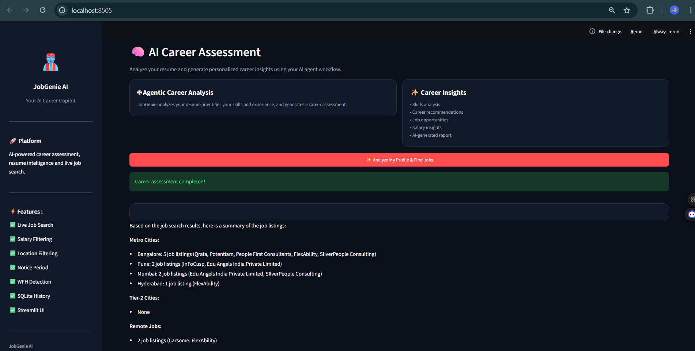
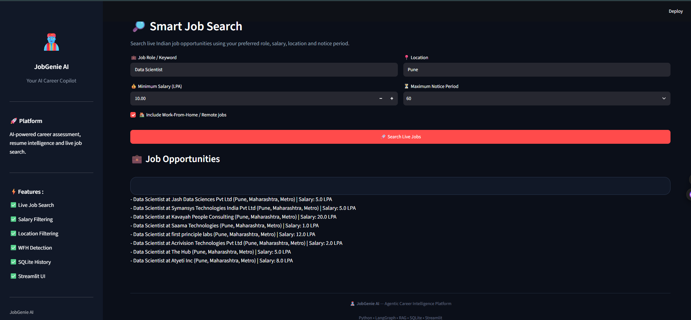
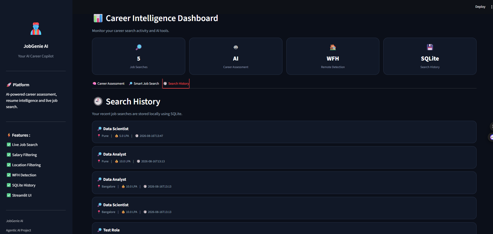

# JobGenie AI – Intelligent Career & Job Search Agent (Week 6)

An AI-powered career intelligence platform that combines resume-based career assessment, live Indian job search, specialized job filtering, SQLite search history, and an interactive Streamlit interface.

Week 6 extends the Week 5 Indian Job Search Specialist by adding notice-period detection, work-from-home detection, persistent search history, and a professional web dashboard.

## Objective

Build a practical career assistant specialized for the Indian job market that can:

- Analyze a resume using a RAG-powered career assessment workflow
- Search live Indian job listings using the Adzuna API
- Convert salary requirements into LPA (Lakhs Per Annum)
- Filter jobs by location and minimum salary
- Detect notice-period requirements from job descriptions
- Detect work-from-home / remote opportunities
- Store job search history using SQLite
- Provide an interactive Streamlit web interface

## Track Chosen

**Indian Job Search Specialist (Track A, Option A1)**

## Features Completed

- Job search tool now detects and flags notice period requirements (30/60/90 days) mentioned in job descriptions, compared against the candidate's own notice period
- Work-from-home mentions are detected and flagged in results
- SQLite `search_history` table stores every search (keyword, salary, location, results, timestamp)
- Streamlit UI with two tabs:
  - **Full Career Assessment** — runs the complete agent workflow
  - **Quick Job Search** — direct search with live results and recent search history
- Verified end-to-end across CLI, API, and UI

## System Workflow

User
-> Streamlit UI
-> Career Assessment / Smart Job Search
-> Career Assessment Agent
-> RAG Resume Retrieval
-> Job Search Agent
-> Adzuna API
-> Notice Period + WFH Detection
-> Job Results
-> SQLite Search History
-> Results displayed in Streamlit

## Tech Stack

| Component | Tool |
|---|---|
| Language | Python |
| Agent framework | LangChain + LangGraph |
| Agent LLM | Groq (Llama 3.3 70B) |
| Embeddings | Google Gemini |
| Vector Store | ChromaDB |
| PDF Parsing | PyPDFLoader |
| Job Search | Adzuna API |
| API Layer | FastAPI + Uvicorn |
| Database | SQLite |
| UI | Streamlit |

## Setup & Run

python -m venv .venv
.venv\Scripts\activate
pip install -r requirements.txt

Create a `.env` file in the project root:

GEMINI_API_KEY=your-key-here
GROQ_API_KEY=your-key-here
ADZUNA_APP_ID=your-key-here
ADZUNA_APP_KEY=your-key-here

Run the agent workflow directly:

python -m app.workflow

Run the API:

uvicorn app.api:app --reload

Then open `http://127.0.0.1:8000/docs`.

Run the interactive UI:

streamlit run app_ui.py

Then open `http://localhost:8501`.

## Sample Output

The job search tool was enhanced with notice-period and work-from-home detection to make job recommendations more relevant to individual candidates. Job descriptions are analyzed for common notice-period and remote-work indicators, and the results are clearly tagged for easier interpretation.

SQLite was introduced to persist job search history locally. Each search stores the keyword, minimum salary requirement, location, results, and timestamp, allowing users to review their recent searches through the Streamlit interface.

A Streamlit dashboard was also added as the main user interface. It provides separate sections for AI career assessment, smart job search, and search history, making the existing multi-agent workflow accessible through an interactive web application.

The project now combines RAG-based resume analysis, agentic workflows, live job APIs, database persistence, and an interactive frontend into a single end-to-end career assistant.

## Project Status

**Project Name:** JobGenie AI – Job Search AI Agent
**Current Phase:** Week 6 — Specialized career features integrated and tested (Week 6 checkpoints met): Notice period, WFH filtering, SQLite search history, and an interactive Streamlit UI, all verified end-to-end alongside the existing agent workflow and API.

## Next Steps

- Add resume upload directly in the UI instead of a hardcoded file path
- Add basic automated tests
- Explore deployment (Streamlit Cloud) for a live, shareable demo
- Add company culture and benefits analysis to round out the Option A1 checklist