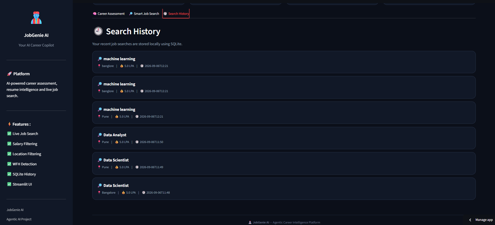

# JobGenie AI – Intelligent Career & Job Search Agent (Final Submission)

An AI-powered career intelligence platform that combines resume-based career assessment, live Indian job search, specialized job filtering, SQLite search history, and an interactive Streamlit interface — now deployed live and accessible to anyone.

This final version extends Week 6 by adding resume selection (choose between your own resume and a sample resume), fixing deployment-specific issues (secrets management, dependency pinning, model deprecation), and shipping a working public deployment on Streamlit Cloud.

**Live Demo:** [https://jobgenie-ai-career-assistant-4u4ugwe857aayzqiw2f65w.streamlit.app]
**Demo Video:** [https://drive.google.com/file/d/114mxfUSGUMgwpDbUCGOXlFKH9Hdey5qC/view?usp=sharing]

## Objective

Build a practical career assistant specialized for the Indian job market that can:

- Analyze a resume using a RAG-powered career assessment workflow
- Let the user choose which resume to analyze
- Search live Indian job listings using the Adzuna API
- Convert salary requirements into LPA (Lakhs Per Annum)
- Filter jobs by location and minimum salary
- Detect notice-period requirements from job descriptions
- Detect work-from-home / remote opportunities
- Store job search history using SQLite
- Provide an interactive Streamlit web interface
- Run live, publicly, not just on a local machine

## Track Chosen

**Indian Job Search Specialist**

## Features Completed

- Resume selection dropdown — choose between your own resume and a sample resume, each processed into its own isolated ChromaDB collection so results never mix
- Job search tool detects and flags notice period requirements (30/60/90 days) mentioned in job descriptions, compared against the candidate's own notice period
- Work-from-home mentions are detected and flagged in results
- SQLite `search_history` table stores every search (keyword, salary, location, results, timestamp)
- Streamlit UI with sections for Career Assessment, Smart Job Search, and Search History
- FastAPI layer with `/assess-and-search`, `/resume/query`, and `/jobs/search` endpoints, each with input validation and error handling
- Deployed live on Streamlit Cloud, with API keys managed through Streamlit Secrets
- Verified end-to-end across CLI, API, UI, and the live deployment

## System Workflow

```
User
 -> Streamlit UI (resume dropdown)
 -> Career Assessment / Smart Job Search
 -> Career Assessment Agent
 -> RAG Resume Retrieval (per-resume ChromaDB collection)
 -> Job Search Agent
 -> Adzuna API
 -> Notice Period + WFH Detection
 -> Job Results (LPA, Metro/Tier-2)
 -> SQLite Search History
 -> Results displayed in Streamlit
```

## Tech Stack

| Component | Tool |
|---|---|
| Language | Python |
| Agent framework | LangChain + LangGraph |
| Agent LLM | Groq (`openai/gpt-oss-120b`) |
| Embeddings | Google Gemini |
| Vector Store | ChromaDB |
| PDF Parsing | PyPDFLoader |
| Job Search | Adzuna API |
| API Layer | FastAPI + Uvicorn |
| Database | SQLite |
| UI | Streamlit |
| Deployment | Streamlit Community Cloud |

## Setup & Run

```
python -m venv .venv
.venv\Scripts\activate
pip install -r requirements.txt
```

Create a `.env` file in the project root:

```
GEMINI_API_KEY=your-key-here
GROQ_API_KEY=your-key-here
ADZUNA_APP_ID=your-key-here
ADZUNA_APP_KEY=your-key-here
```

Run the agent workflow directly:
```
python -m app.workflow
```

Run the API:
```
uvicorn app.api:app --reload
```
Then open `http://127.0.0.1:8000/docs`.

Run the interactive UI:
```
streamlit run app_ui.py
```
Then open `http://localhost:8501`.

## Sample Output




The job search tool was enhanced with notice-period and work-from-home detection to make job recommendations more relevant to individual candidates. Job descriptions are analyzed for common notice-period and remote-work indicators, and the results are clearly tagged for easier interpretation.

SQLite was introduced to persist job search history locally. Each search stores the keyword, minimum salary requirement, location, results, and timestamp, allowing users to review their recent searches through the Streamlit interface.

A resume selection dropdown was added so the same platform can analyze either the user's own resume or a sample resume, with each resume processed into its own isolated vector store to avoid mixing results between them.

The application was then deployed to Streamlit Cloud. This surfaced a few issues that never appeared locally: dependencies that were installed locally but missing from `requirements.txt`, API keys needing to load from Streamlit's secrets manager before any module that reads them at import time, and a Groq model (`llama-3.3-70b-versatile`) that had been deprecated since development started and needed to be swapped for a currently supported one.

The project now combines RAG-based resume analysis, agentic workflows, live job APIs, database persistence, and an interactive frontend into a single end-to-end career assistant — live and publicly accessible.

## Project Status

**Project Name:** JobGenie AI – Job Search AI Agent
**Current Phase:** Final Submission — all specialized career features, the multi-agent workflow, the API layer, and the interactive UI are integrated, tested end-to-end, and deployed live on Streamlit Cloud.

## Known Limitations

- Naukri.com and TimesJobs don't offer public developer APIs (enterprise partnerships only); Adzuna's India region endpoint is used as a functionally equivalent substitute
- Notice period and WFH detection use keyword matching on job descriptions rather than a structured field, since most job boards don't expose this cleanly
- No user authentication — this is a single-user demo, not a multi-tenant production system
- Resume selection is a preset dropdown rather than a true file uploader

## Next Steps

- Add a real resume upload widget instead of the preset dropdown
- Add basic automated tests
- Add company culture and benefits analysis to round out the Option A1 checklist
- Explore a mock interview module