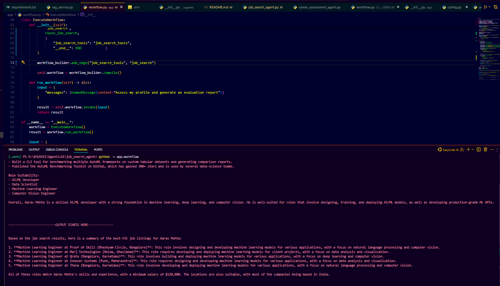

# JobGenie – AI Agent Workflow
## Week 4 Progress

RAG-powered career assessment agent using LangChain, LangGraph, Google Gemini embeddings, ChromaDB, and Groq for AI-powered career assistance.
This week: extended the workflow to a second agent - a Job Search Agent, that takes the career assessment as input and searches live
job listings via the Adzuna API. The LangGraph workflow now routes between two agents in sequence.

## Objective

Connect the Career Assessment Agent and Job Search Agent into a single end-to-end LangGraph workflow, so a resume goes in and a full career report plus matching live job listings come out — with no manual steps in between.

## Features Completed

- `query_resume()` on the RAG service for semantic search over the resume vector store
- Career Assessment Agent — an LLM (Groq / Llama 3.3) bound to a `fetch_resume_data` tool
- Job Search Agent — an LLM bound to a `job_search_tool` that calls the live Adzuna jobs API
- LangGraph workflow routing career assessment straight into job search once the assessment is complete, instead of ending early
- Job search agent uses the career report already in the conversation history to pick a relevant search keyword
- Tested end-to-end: resume data → career assessment → live Adzuna job search → final combined report with real job listings

## Workflow

User request
-> Career Assessment Agent -> needs resume data? yes -> fetch_resume_data tool -> back to Career Assessment Agent
-> no -> hands off to Job Search Agent-> Job Search Agent-> needs job listings? yes -> job_search_tool (Adzuna) -> back to Job Search Agent
-> no -> Final combined report -> END

## Tech Stack

| Component | Tool |
|---|---|
| Language | Python |
| Agent framework | LangChain + LangGraph |
| Agent LLM | Groq (Llama 3.3 70B) |
| Embeddings | Google Gemini |
| Vector Store | ChromaDB |
| PDF Parsing | PyPDFLoader |
| Job Search | Adzuna API |

## Setup & Run

'''python -m venv .venv
.venv\Scripts\activate
pip install -r requirements.txt'''

Create a `.env` file in the project root:

'''GEMINI_API_KEY=your-key-here
GROQ_API_KEY=your-key-here
ADZUNA_APP_ID=your-key-here
ADZUNA_APP_KEY=your-key-here'''

Run the agent workflow:

'''python -m app.workflow
'''
## Sample Output

## Notes

This week's main lesson: connecting two agents in one LangGraph workflow just means pointing one agent's "__end__" route to the next agent's node instead of straight to END.The shared conversation history is what lets the second agent see what the first one already found. Also spent time chasing a small variable-name typo (`api_key` vs `app_key`) that produced a confusing traceback several layers deep in a library — a good reminder that Python's own "Did you mean" suggestions are worth reading carefully.

## Project Status

**Project Name:** JobGenie AI – Job Search AI Agent
**Current Phase:** Week 4 — Career Assessment Agent and Job Search Agent connected into a single multi-agent LangGraph workflow, tested end-to-end.

## Next Steps

- Add error handling so a failed tool call (e.g. Adzuna API timeout) doesn't crash the whole workflow
- Add a visual diagram of the LangGraph graph itself
- Add basic automated tests